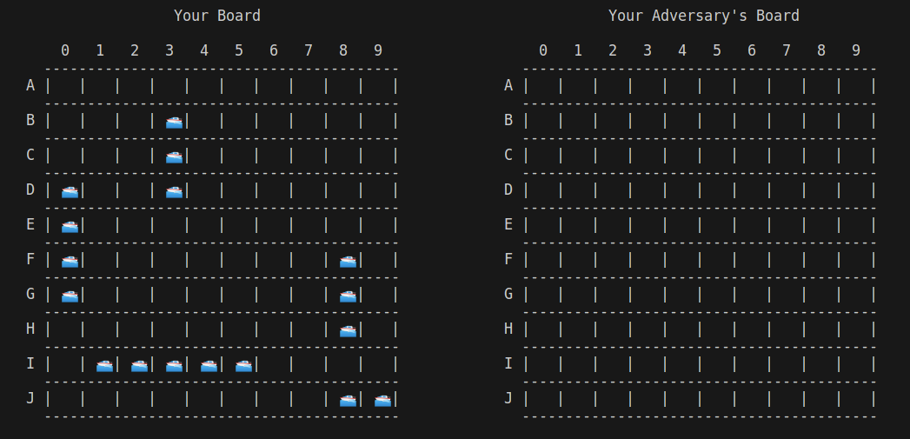
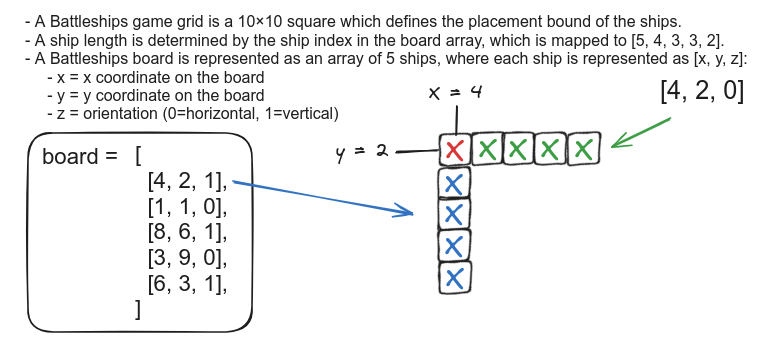
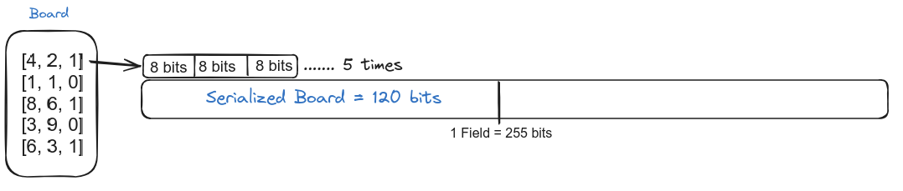
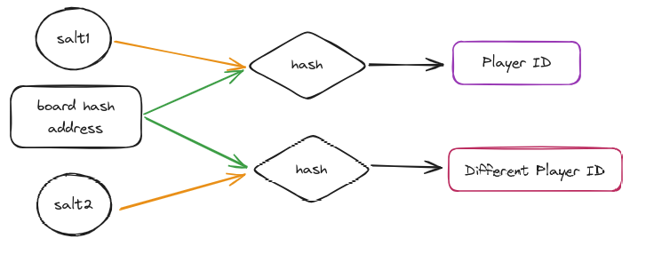
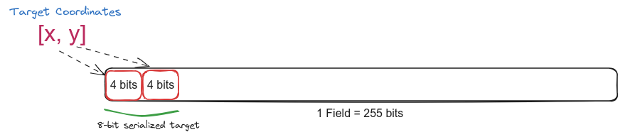
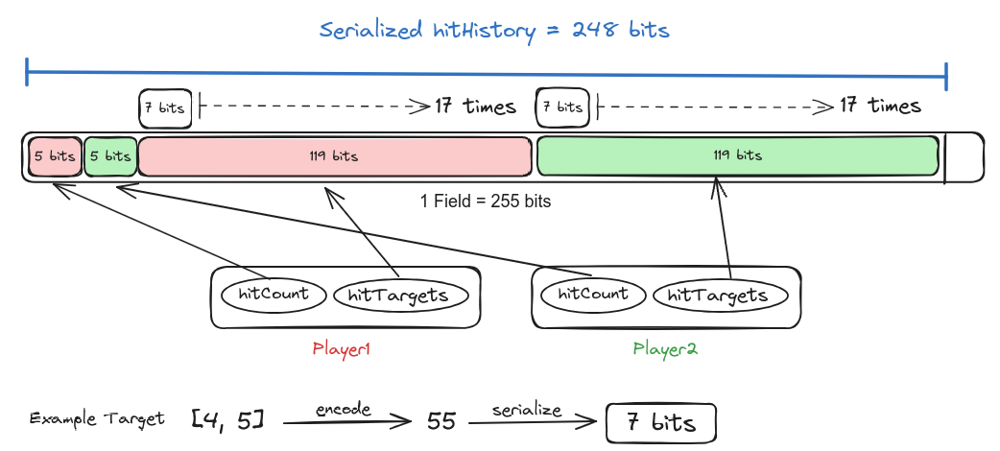
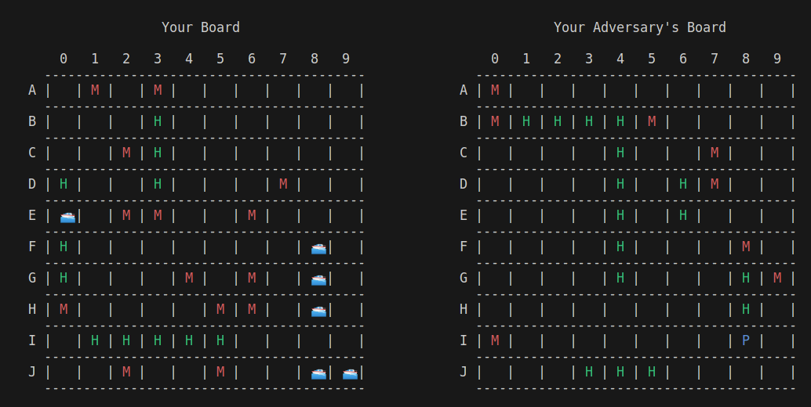
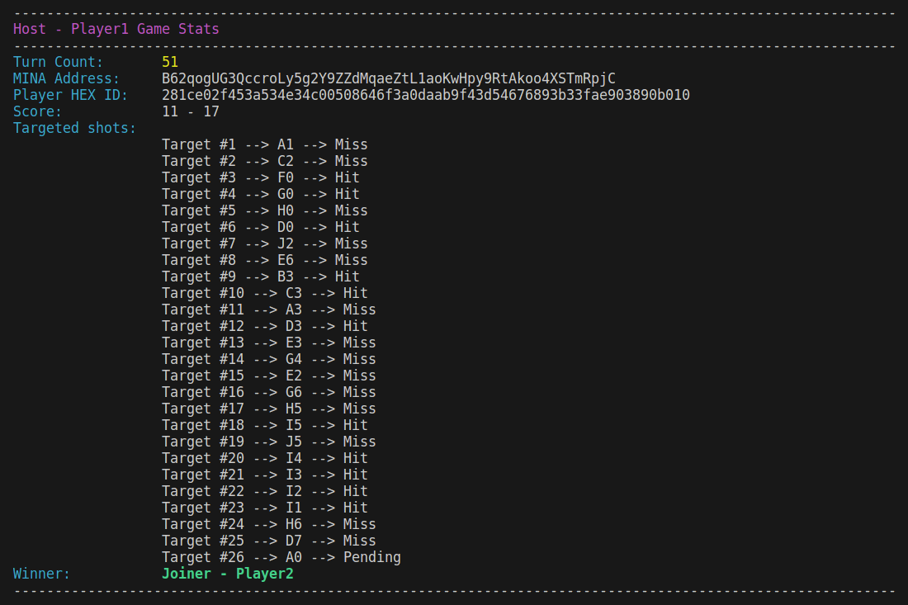

# Mina ZK Battleships

## Basic Game Description


### Game Definition

- [Battleships](https://en.wikipedia.org/wiki/Battleship_(game)) (also known as **Sea Battle**) is a strategy-type guessing game for two players.
- It is played on ruled grids (paper or board) on which each player's fleet of warships is marked.
- The locations of the fleets are **concealed** from the other player.
- Players alternate turns calling "shots" at the other player's ships, and the objective of the game is to destroy the opposing player's fleet.

- The paper/board game is played on four grids, two for each player.

- The grids are typically square – usually **10×10** – and the individual squares in the grid are identified by letter and number.

- On one grid the player arranges ships and records the shots by the opponent. On the other grid, the player records their own shots.



### Setup 
- Before play begins, each player secretly arranges their ships on their primary grid. Each ship occupies a number of consecutive squares on the grid, arranged either horizontally or vertically.
- The number of squares for each ship is determined by the type of ship. The ships cannot overlap (i.e., only one ship can occupy any given square in the grid).
- The types and numbers of ships allowed are the same for each player.
    
    | No. | Class of ship | Size |
    | --- | ---           | ---  |
    | 1   | carrier       | 5    |
    | 2   | cruiser       | 4    |
    | 3   | destroyer     | 3    |
    | 4   | submarine     | 3    |
    | 5   | patrol  boat  | 2    |



- The ships should be hidden from the player’s sight and it's not allowed to see each other's pieces.
- The game is a discovery game in which players need to discover their opponent's ship positions.

### Motivation:
- A fundamental element of the game is that it involves “trust” between the players.
- The game assumes that each player honestly announces if the shot has successfully hit his/her own ship.
- Given that the game is traditionally held physically between two players, they can reconcile each other’s “shot” records at the end of the game, so it is not too bad.
- However, if the game is held remotely (e.g. internet), the assumption of trust would not work well, especially if the players want to bet money on a win.
- When building a Battleships game as a **web application**, the obvious implementation is that the actual ship deployment is stored in the web server, and the verification of whether the ships get hit or not is also performed by the web server, which is indeed centralized and trusted by all players 😟.

### Solution:
- Moving the implementation to be decentralized as a peer-to-peer game (or Dapp) is a noteworthy solution to involve money in games as well as eliminating trust between players or any other centralized authority.

- The Mina blockchain, with its unique design centered around succinct blockchain technology, offers several features that can contribute to developing a trustless and private Battleships game:
    - **Decentralization**: Mina blockchain is decentralized, meaning that no single entity has control over the network. This decentralization ensures that the Battleships game can operate in a trustless manner, without relying on a centralized authority to manage game logic or verify transactions. Players can participate in Battleships games directly on the Mina blockchain, knowing that the game is governed by transparent and immutable smart contracts(zkapp).

    - Mina **zk-SNARKs Integration** enables privacy-preserving transactions. With zk-SNARKs, users can prove the validity of transactions without revealing any sensitive information, such as the player's game board configuration.

    - **Succinctness**: Mina blockchain is designed to maintain a constant-size blockchain regardless of the transaction volume or history. For a Battleships game, this means that the game state and transaction history remain lightweight and easily verifiable by all participants.
---


# Game Architecture Considerations

Most of the game architecture considerations are a workaround to accommodate the Battleships game state within the confines of the allowed 8 field elements on-chain.

## Board

- **Hash board**
    - A board is a set of 5 ships each with [x, y, z] coordinates, if we were to store the complete board data then that would take 15 field elements which exceeds the 8 state storage limit on-chain.
    - Storing the poseidon hash of the board reduces storage from 15 to one field element :)
    - Hashing sensitive data before storing it on-chain can help maintain privacy. Only the hash values are visible on the blockchain, while the original data remains hidden.
    - By hashing data and storing only the hash on-chain, smart contracts can ensure the integrity of the original data. Any change to the data off-chain will result in a different hash value, alerting the contract to potential tampering.

- **Serialize board**
    - Submitting only the board hash would not be practical for our game on-chain:
        - First, the zkapp must validate the board(no collisions & no ship is out of bound).
        - Second, the zkapp must return adversary's hit result by scanning the target through the player's board.
    - We need to store the board hash on-chain to use it as a public input to assert player's board integrity along the game progress but it doesn't allow us to use the board for different operations!
    - The Mina zkapp method do not support array inputs therefore we use serialization to submit the board as a single field element.

    ---
    **Board Serialization Technique**:
    - We take any range of bits that has greater size than the greatest possible number in the ship coordinates
    - For our case, 9 is the greatest possible number .i.e [9, 9, 1] as any greater number will cause an `Out of bound` error.
    - For a POC we choose 8 bits which has a range of 0 to 255.
    - It is easy to convert a field to bits with `o1js` using `.toBits(8)` method on provable field Type.
    - For a ship [x, y, z], we have a ship represented as 24 -bit field element after merging the bits.
    - We keep doing the same for all 5 ships and after merging all ships we obtain a serialized board represented as a 24x5= 120-bit field element.
    - As for deserialization, we just do the reverse operation which is quite easy with the `o1js` API.

      


## Player
- If the turn count is even then it's player1's turn.
- If the turn count is odd then it's player2's turn.
- **Note**: The host (player1) has the privilege to attack first.


### Player ID

- Initially the player ID was set as a [struct](https://docs.minaprotocol.com/zkapps/tutorials/common-types-and-functions#struct) that contains:
    1. Player address(2 field elements)
    2. Player's board hash(1 field element)
- The player's address can be hashed to fit one field element but that's still not efficient due to the variety of game state storage variables.
- Such data structure makes it easy to exceed more than 8 pieces of state, as we need a struct for each player which holds 6 field states on-chain(4 if the address is hashed).

- Basically, we want to identify the player from his address `this.sender`.
- We also want to verify the player's board integrity for the zkapp to scan the adversary's attack.


**SOLUTION**

- Send the serialized board as the method input.
- Deserialize the input to retrieve the board array (crucial for other operations).
- The zkapp hashes the original board array.
- Combine both required arguments by hashing [playerAddress, boardHash].
==> The result is an argument called playerId that consolidates multiple fields into a single state on-chain.

*What if a player with the same address uses the same board configuration?*

- If a player intends to reuse the same board for another game, the player, with the identical board and address, will publish the same player ID on-chain.
- However, this practice could inadvertently disclose information about the player's board since game state updates are publicly stored on the Mina blockchain.
- To enhance the solution, a salt(random field) is introduced to the hash input: `hash(boardHash, address, salt)`. 
- This adjustment ensures the generation of a distinct ID regardless of how frequently the same board or address is employed.

  
- **Note** It is critical to hash multiple inputs in the same order and using the same hash function consistently.

- **Note:** While hashing multiple inputs to check for integrity can save storage on-chain, it introduces challenges in error handling, as error conditions become implicitly tied to the hashed player ID.
    - For instance, consider four cases where a subsequent method like `firstTurn` or `attack` may reject a player for various reasons:
        1. The board is different, despite all other data being consistent.
        2. The sender address is different, even when other data remains consistent.
        3. The salt value differs, despite consistent data otherwise.
        4. It's not the current player's turn, even when all data is accurate.
    - These scenarios require explicit error handling to notify users appropriately when a transaction is rejected. However, due to the nature of hashed player IDs, distinguishing between these cases becomes challenging.


### Game Host (Player1)

- Initially, the `hostGame` method was designed to accept any player who wants to host a game:
    1. The zkApp validates the board.
    2. The zkApp calculates the host ID.
    3. The host ID is stored on-chain.

- While the above logic is correct, it lacks a crucial check:
    - What if someone calls the `hostGame` method?
        - Then the host ID stored on-chain can be updated if a meddler provides a valid board (ship placement).
        - This could disrupt the game order as every ongoing state would refer to the new host (Player1 ID).

- **Solution**
    - Initialize `playerID` as `Field(0)`.
    - Modify the `hostGame` method to only update the host ID if the initial ID stored on-chain is `Field(0)`.
    - This change ensures that the `hostGame` method is callable only once, preventing other players from tampering with the host ID of an ongoing game.


### Game Joiner (Player2)

- Previously, the battleships game state included a `Bool` variable named `joinable` to track whether the game was full or not.

- However, this approach is unnecessary as game fullness can be determined by checking whether Player 1 and Player 2 IDs have already been updated.

- The `joinable` variable was used to prevent other players from tampering with the current joiner's ID stored on-chain.
    - Now, similar to the `hostGame` method:
        1. Before updating, the `player2Id` is asserted to be `Field(0)`.
        2. Validate the joiner's board.
        3. Calculate the joiner ID.
        4. Update the on-chain `player2Id` (joiner).

- **Note:** The `o1js Bool type` takes the size of a field element of value 0 or 1, resulting in a full storage state on-chain for a stored Bool.

## [On-chain State Variables](https://github.com/Shigoto-dev19/mina-battleships/blob/main/src/Battleships.ts#L34-L41)

### player1Id & player2Id

- These variables store unique identifiers (IDs) representing the respective player's cryptographic hash. 
- Each player's ID is computed based on their game board, address, and a salt ensuring a secure and tamper-proof association between the player and their game state.

### turnCount

- The `turnCount` variable tracks the current turn number within the game. 
- It enables the game logic to determine which player's turn it is, facilitating the orderly progression of gameplay and ensuring fairness.
- It is also used to restrict the call frequency of method to 1 such as `hostGame`, `joinGame`, and `firstTurn`.

### target

- The target variable serves as the repository for the serialized coordinates representing the player's chosen target for their attack.

- In designing a zkapp method, it's essential to consider that array inputs are typically not accommodated. Instead, a target is represented by an `[x, y]` coordinate pair selected by the user.

- While it's technically feasible to accept individual fields `(xTarget: Field, yTarget: Field)` within the method, it's notable that the on-chain state variable can only be single field elements. 

- Serialization of the player's target is employed to meet these requirements effectively.

- This approach not only demonstrates data compression techniques but also addresses potential user-error scenarios by safeguarding against inadvertent alterations to input values.
<!-- - The target variable stores the serialized coordinates of the player's selected target for their attack.

- When designing a zkapp method, it's worth noting that array inputs aren't typically accepted, and a target is represented by an [x, y] coordinate pair selected by the user.

- Although it's feasible to accept individual fields `(xTarget: Field, yTarget: Field)` within the method, we also need to store the target as a single field element.

- The player's target is serialized in order to satisfy the requirements.

- This way not only showcases data compression techniques but also mitigates potential user-error cases, such as inadvertent alterations to the input values. -->
---
**Target Serialization Technique**:
- Similar to board serialization, we need to accommodate the maximum possible coordinate values, such as `[9, 9]`. To determine the required number of bits, we calculate the maximum bits needed for a single coordinate, which for the value 9 is **4 bits**.

- Subsequently, we apply a bitification process to each coordinate and merge them to obtain an 8-bit serialized single field element.

    
- For deserialization, we simply extract the first 8 bits from the serialized field and perform the reverse operation to obtain the [x, y] coordinate pair as a 2-element field array.

### targetRoot

- The `targetRoot` variable holds the root hash of a Merkle tree that stores the history of player targets. This cryptographic structure ensures the integrity and consistency of the target data, offering a secure and efficient means of verifying the accuracy of stored targets off-chain.

- Each leaf of the Merkle tree corresponds to a player target, and the tree is updated in parallel with the `turnCount` state value.
  - Specifically, player 1's targets are stored in leaves with even indices, while player 2's targets occupy leaves with odd indices.

- By binding the Merkle Tree to the `turnCount`, the `targetRoot` provides valuable information regarding which player selected a target and when, facilitating the synchronization of gameplay progression.

### hitResult

- The `hitResult` variable is a Boolean value that signifies the outcome of a player's attack on their adversary's board.

- When a player initiates an attack, they retrieve the adversary's target and scan it against their own board. 

- The hit result, indicates whether the attack successfully hit a target (true) or missed (false).


### hitRoot

- The `hitRoot` variable functions similarly to the `targetRoot`, holding the root hash of a Merkle tree responsible for storing the history of hit results.

- Just as with the target data, the hit data is maintained within the Merkle tree to ensure its integrity and synchronization.

- This cryptographic structure provides a reliable means for players to verify the accuracy of reported hits and misses throughout the gameplay.

### Serialized Hit History

- The `serializedHitHistory` variable serves as a repository for the serialized history of hit results, containing detailed information about each player's attacks and their outcomes.

- It stores the hit count for each player along with the corresponding target that incremented the count when a hit occurred (hit=true). 

- The hit count is crucial for tracking game progress and determining a winner. 

- A board contains 5 ships with lengths [5, 4, 3, 3, 2], meaning that if the hit count reaches 17, all ships are destroyed, signaling the end of the game.

- Additionally, to maintain game fairness, it's essential to prevent players from selecting the same target that resulted in a hit to repeatedly increment the hit count until they win. 

- To achieve this, the hit targets are stored, and any subsequent attempts to select these targets are nullified. This ensures that the game remains fair and prevents exploitation by players.

- Only the targets that resulted in a hit are relevant for determining the game's outcome, storage for the miss targets is not necessary, as they do not affect the win state.

---
**Hit History Serialization Technique**

- To effectively store the hit history, we require two types of variables:
  - Hit counts, one for each player.
  - Serialized targets, totaling 34 (17 for each player).

- Considering the range of our variables:
  - The maximum hit count is 17, requiring a maximum bit size of 5 bits.
  - Serialized targets have a hash size of 8 bits.
  - Calculating the total, we have `5 * 2 + 34 * 8 = 282 bits`, which exceeds the field size of 255 bits.

- To optimize our serialization approach, we encode the target and then serialize:
  - Instead of bitifying two numbers in the range 0 to 9, we encode the target [x, y] using a simple equation `x + 10 + y + 1`.
    - **Note:** Adding one distinguishes a serialized target from the initial zero bits in a field .i.e. target=[0, 0] landing a successful hit.
  - Thus, the maximum result size for a target [9, 9] would be `100`, occupying 7 bits.
  - This refinement saves one bit per target. Upon recalculation, we have `5 * 2 + 34 * 7 = 248 bits`, which falls within the range of a field size.

    

- While one might argue that deserialization could be costly, we circumvent this issue by scanning encoded hits directly for occurrence, eliminating the need for explicit deserialization.

**Remarks on On-chain Storage Workarounds**

- Serialized state variables within the zkapp are deserialized, updated, and serialized again before being stored.

- Serialization optimizes on-chain storage usage but increases computational effort when generating a proof.

- Storing a hash of multiple variables reduces on-chain storage requirements, but it becomes challenging to identify which variable caused the hash non-compliance if any of them are incorrect.


## Battleships ZkApp methods


### Join & Host Game methods

- The `hostGame` & `joinGame` follow a straightforward approach.
- The zkapp first checks for the absence of a registered player ID.
- It proceeds by accepting the player's board and validating it.
- The player board hash, along with the address and salt, is then used to generate the player ID.
- This generated player ID is promptly stored on-chain, completing the process effortlessly.

### First Turn 

- The game commences with the host player initiating the first turn, making the opening shot.

- Despite the `firstTurn` method not returning an attack result or operating on the player's board, it does require the player's board as an argument solely to generate and verify the player's ID.

- The verification process in proof verification is inherently reactive, with the first target being pivotal to initiating the cycle.

- While this game principle preserves players' board privacy, it does introduce a delay of one turn to report the hit result to the adversary.

- Due to this unavoidable delay, the first player (host) only needs to select their target and store it on-chain to initiate the alternate attack sequence.

- To ensure consistent storage of target history, we've implemented a Merkle Tree commitment for target storage, verifying that players are correctly storing the game targets off-chain.

- While not crucial for the `firstTurn` method, the inclusion of the **TargetMerkleWitness** argument in the architecture helps maintain the initialized target root's accuracy. 
    - Without this, the zkApp would expect the `attack` method to have a target Merkle root initialized with the `firstTurn` target.
    - This potentially adds further requirements for players to provide the expected root later on.

- The `firstTurn` method operates as follows:
    1. Assert that the game hasn't started yet (`this.turnCount == 0`).
    2. Restrict access to the host (generate ID and verify).
    3. Validate that the host's target falls within the game map range.
        - **Note:** While the attack method validates the target, having an invalid target at the first turn would necessitate the host to replay the **first turn**, potentially disrupting the game's order.
    4. Store the player's target on-chain.
    5. Increment the turn counter.

### Attack

- The Attack method is pivotal in the gameplay, as it reports the outcome of the adversary's attack and allows the player to choose a target for retaliation.

- Initiating this method triggers several key actions:
    - The player (caller) retrieves the adversary's attack result from the previous turn:
        1. Fetches the adversary's target stored on-chain.
        2. Deserializes and scans it against their own board.
        3. Returns true for a hit and false for a miss.
    - The caller selects a target and stores it on-chain.

- Several **checks** ensure the integrity and security of the game's progression:
    - The zkApp limits method execution to the current eligible player:
        - No one is allowed to call the attack method before the `first turn` is complete.
        - If the turn count is even, the host (player1) is eligible; if odd, it's the joiner (player2).

    - The zkApp nullifies any target that resulted in a successful hit, preventing players from exploiting the same target to continuously score points.

    - The zkapp verifies the off-chain storage integrity:
        - Verifying the Merkle trees' roots and ensuring the consistency of leaf indexes with the turn counter to guarantee order consistency of target & hit-result storage.
   
- A winner is concluded if the adversary's hit count reaches 17.

- Repeatedly calling this function progresses the game to its completion state. 

- The loser will always be the last to call this function, thereby concluding the game.

## How to build

```sh
npm run build
```

## How to run tests
```sh
npm run test
npm run testw # watch mode
```

## How to run coverage
```sh
npm run coverage
```

## How to run game simulation
```sh
npm run simulate
npm run simulate provable # provable mode
```
**Note:** The provable mode simulation can take up to 12 minutes to complete!

- The simulation shows the grid display of the player
    

- The simulation shows also the display of the player stats
    

## License

[Apache-2.0](LICENSE)
